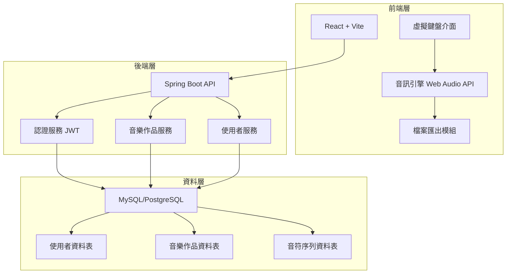
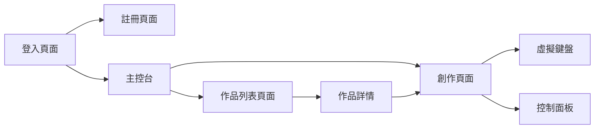

# MelodyGround 音樂創作平台 - 架構規劃

## 專案概述

MelodyGround 是一個全端網頁應用程式，讓使用者可以透過虛擬鍵盤創作音樂，支援多種樂器和音域切換，並能將作品儲存為 MIDI 或音訊檔案。

### 技術棧

**前端：**
- React 18+ with JavaScript
- Vite (建置工具)
- React Router (路由管理)
- Axios (HTTP 客戶端)
- Tone.js 或 Web Audio API (音訊處理)
- MidiWriterJS (MIDI 檔案生成)
- Recorder.js 或 MediaRecorder API (音訊錄製)

**後端：**
- Spring Boot 3.x
- Spring Security + JWT (認證授權)
- Spring Data JPA (資料存取)
- MySQL 或 PostgreSQL (資料庫)
- Maven (依賴管理)

---

## 系統架構圖



---

## 資料庫設計

### 使用者資料表 (users)

| 欄位名稱 | 資料型別 | 說明 |
|---------|---------|------|
| id | BIGINT | 主鍵，自動遞增 |
| username | VARCHAR(50) | 使用者名稱，唯一 |
| email | VARCHAR(100) | 電子郵件，唯一 |
| password | VARCHAR(255) | 加密後的密碼 |
| created_at | TIMESTAMP | 建立時間 |
| updated_at | TIMESTAMP | 更新時間 |

### 音樂作品資料表 (compositions)

| 欄位名稱 | 資料型別 | 說明 |
|---------|---------|------|
| id | BIGINT | 主鍵，自動遞增 |
| user_id | BIGINT | 外鍵，關聯使用者 |
| title | VARCHAR(200) | 作品標題 |
| description | TEXT | 作品描述 |
| tempo | INT | 速度 (BPM) |
| created_at | TIMESTAMP | 建立時間 |
| updated_at | TIMESTAMP | 更新時間 |

### 音符序列資料表 (note_sequences)

| 欄位名稱 | 資料型別 | 說明 |
|---------|---------|------|
| id | BIGINT | 主鍵，自動遞增 |
| composition_id | BIGINT | 外鍵，關聯音樂作品 |
| timestamp | BIGINT | 音符觸發時間（毫秒） |
| note | VARCHAR(10) | 音符名稱（如 C4, D#5） |
| instrument | VARCHAR(50) | 樂器類型 |
| duration | INT | 持續時間（毫秒） |
| velocity | INT | 力度（0-127） |

---

## API 端點設計

### 認證相關

- `POST /api/auth/register` - 使用者註冊
- `POST /api/auth/login` - 使用者登入
- `POST /api/auth/logout` - 使用者登出
- `GET /api/auth/me` - 取得當前使用者資訊

### 音樂作品相關

- `GET /api/compositions` - 取得使用者的所有作品列表
- `GET /api/compositions/{id}` - 取得特定作品詳情
- `POST /api/compositions` - 建立新作品
- `PUT /api/compositions/{id}` - 更新作品
- `DELETE /api/compositions/{id}` - 刪除作品
- `GET /api/compositions/{id}/export/midi` - 匯出 MIDI 檔案
- `GET /api/compositions/{id}/notes` - 取得作品的音符序列

---

## 前端頁面結構



### 主要頁面

1. **登入/註冊頁面** (`/login`, `/register`)
   - 使用者認證表單
   - JWT token 管理

2. **主控台** (`/dashboard`)
   - 顯示使用者資訊
   - 快速導航到創作或作品列表

3. **創作頁面** (`/compose`)
   - 三排虛擬鍵盤（每排 10-12 個按鍵）
   - 樂器選擇器（鋼琴、吉他、鼓、貝斯等）
   - 音域選擇器（低音、中音、高音）
   - 錄製/停止/播放控制按鈕
   - 速度調整（BPM）
   - 儲存/匯出功能

4. **作品列表頁面** (`/compositions`)
   - 顯示所有已儲存的作品
   - 搜尋和篩選功能
   - 載入、編輯、刪除操作

---

## 核心功能實作細節

### 1. 虛擬鍵盤設計

**鍵盤配置：**
- 第一排：Q W E R T Y U I O P（對應 C4-B4）
- 第二排：A S D F G H J K L（對應 C5-A5）
- 第三排：Z X C V B N M（對應 C3-G3）

**功能特性：**
- 滑鼠點擊觸發
- 鍵盤按鍵觸發
- 視覺回饋（按下時高亮）
- 支援同時按下多個按鍵（和弦）

### 2. 音訊處理

使用 **Tone.js** 函式庫：
- 提供多種內建樂器音色
- 支援音效合成
- 精確的時間控制
- 易於整合錄製功能

```javascript
// 範例程式碼結構
import * as Tone from 'tone';

const synth = new Tone.Synth().toDestination();
synth.triggerAttackRelease("C4", "8n");
```

### 3. 錄製功能

**錄製流程：**
1. 使用者點擊「開始錄製」
2. 記錄每次按鍵的時間戳、音符、樂器
3. 儲存到陣列中
4. 點擊「停止錄製」結束

**資料結構：**
```javascript
{
  notes: [
    { timestamp: 0, note: 'C4', instrument: 'piano', duration: 500 },
    { timestamp: 500, note: 'E4', instrument: 'piano', duration: 500 },
    // ...
  ],
  tempo: 120,
  title: '我的作品'
}
```

### 4. 播放功能

根據錄製的時間戳序列，使用 `setTimeout` 或 Tone.js 的 Transport 系統重播音符。

### 5. MIDI 匯出

使用 **MidiWriterJS** 函式庫：
```javascript
import MidiWriter from 'midi-writer-js';

const track = new MidiWriter.Track();
track.addEvent(new MidiWriter.NoteEvent({
  pitch: ['C4'],
  duration: '4'
}));

const write = new MidiWriter.Writer(track);
const midiData = write.buildFile();
```

### 6. 音訊檔案匯出 (WAV/MP3)

**方法一：前端錄製**
- 使用 MediaRecorder API 錄製播放時的音訊
- 轉換為 WAV 或 MP3 格式
- 提供下載

**方法二：後端處理**
- 前端傳送音符序列到後端
- 後端使用音訊處理函式庫生成音訊檔案
- 回傳檔案供下載

建議使用方法一，因為前端已經有完整的音訊引擎。

---

## 安全性考量

1. **密碼加密**：使用 BCrypt 加密儲存
2. **JWT Token**：設定合理的過期時間（如 24 小時）
3. **CORS 設定**：限制允許的來源
4. **輸入驗證**：前後端都要驗證使用者輸入
5. **SQL 注入防護**：使用 JPA 參數化查詢
6. **檔案大小限制**：限制上傳和匯出的檔案大小

---

## 專案目錄結構

### 前端結構
```
melody-ground-frontend/
├── public/
│   └── sounds/              # 音效檔案（如需要）
├── src/
│   ├── assets/              # 靜態資源
│   ├── components/          # React 元件
│   │   ├── Auth/           # 認證相關元件
│   │   ├── Keyboard/       # 鍵盤元件
│   │   ├── Controls/       # 控制面板元件
│   │   └── Common/         # 共用元件
│   ├── pages/              # 頁面元件
│   │   ├── Login.jsx
│   │   ├── Register.jsx
│   │   ├── Dashboard.jsx
│   │   ├── Compose.jsx
│   │   └── Compositions.jsx
│   ├── services/           # API 服務
│   │   ├── authService.js
│   │   ├── compositionService.js
│   │   └── audioService.js
│   ├── utils/              # 工具函式
│   │   ├── midiExporter.js
│   │   └── audioRecorder.js
│   ├── hooks/              # 自訂 Hooks
│   ├── context/            # React Context
│   ├── App.jsx
│   └── main.jsx
├── package.json
└── vite.config.js
```

### 後端結構
```
melody-ground-backend/
├── src/
│   └── main/
│       ├── java/
│       │   └── com/melodyground/
│       │       ├── config/          # 配置類別
│       │       │   ├── SecurityConfig.java
│       │       │   └── CorsConfig.java
│       │       ├── controller/      # 控制器
│       │       │   ├── AuthController.java
│       │       │   └── CompositionController.java
│       │       ├── model/           # 實體類別
│       │       │   ├── User.java
│       │       │   ├── Composition.java
│       │       │   └── NoteSequence.java
│       │       ├── repository/      # 資料存取層
│       │       │   ├── UserRepository.java
│       │       │   ├── CompositionRepository.java
│       │       │   └── NoteSequenceRepository.java
│       │       ├── service/         # 業務邏輯層
│       │       │   ├── AuthService.java
│       │       │   ├── CompositionService.java
│       │       │   └── UserService.java
│       │       ├── dto/             # 資料傳輸物件
│       │       ├── security/        # 安全相關
│       │       │   ├── JwtTokenProvider.java
│       │       │   └── JwtAuthenticationFilter.java
│       │       └── MelodyGroundApplication.java
│       └── resources/
│           ├── application.properties
│           └── application-dev.properties
├── pom.xml
└── README.md
```

---

## 開發階段規劃

### 第一階段：基礎建設
- 建立前後端專案結構
- 設定資料庫連線
- 實作使用者認證系統
- 建立基本的 UI 框架

### 第二階段：核心功能
- 實作虛擬鍵盤介面
- 整合音訊播放功能
- 實作錄製和播放功能
- 實作樂器和音域切換

### 第三階段：儲存與匯出
- 實作作品儲存到資料庫
- 實作作品列表和載入
- 實作 MIDI 匯出功能
- 實作音訊檔案匯出功能

### 第四階段：優化與測試
- UI/UX 優化
- 效能優化
- 錯誤處理完善
- 整合測試

---

## 技術挑戰與解決方案

### 挑戰 1：音訊延遲
**解決方案：**
- 使用 Web Audio API 的低延遲特性
- 預載音訊資源
- 優化事件處理

### 挑戰 2：大量音符資料儲存
**解決方案：**
- 使用 JSON 格式壓縮儲存
- 考慮分頁載入長作品
- 實作資料快取機制

### 挑戰 3：跨瀏覽器相容性
**解決方案：**
- 使用成熟的函式庫（Tone.js）
- 進行多瀏覽器測試
- 提供降級方案

### 挑戰 4：即時音訊錄製品質
**解決方案：**
- 使用高品質的音訊編碼設定
- 提供音質選項讓使用者選擇
- 優化音訊處理流程

---

## 未來擴充功能

1. **協作功能**：多人即時協作創作
2. **音樂社群**：分享和探索其他使用者的作品
3. **進階編輯**：音符編輯器、效果器、混音功能
4. **行動版支援**：響應式設計或原生 App
5. **AI 輔助**：自動和弦建議、旋律生成
6. **樂譜顯示**：將音符轉換為五線譜顯示
7. **更多樂器**：擴充樂器庫
8. **音訊效果**：混響、延遲、失真等效果器

---

## 開發環境需求

### 前端開發環境
- Node.js 18+
- npm 或 yarn
- 現代瀏覽器（Chrome、Firefox、Edge）

### 後端開發環境
- JDK 17+
- Maven 3.8+
- MySQL 8.0+ 或 PostgreSQL 14+
- IDE（IntelliJ IDEA 或 Eclipse）

### 開發工具
- Git（版本控制）
- Postman（API 測試）
- VS Code 或 WebStorm（前端開發）

---

## 總結

這個專案結合了前端音訊處理、後端 API 開發、資料庫設計等多個技術領域。透過模組化的設計和清晰的架構，可以逐步實現一個功能完整的音樂創作平台。建議按照規劃的階段循序漸進開發，先完成核心功能，再逐步擴充進階特性。
